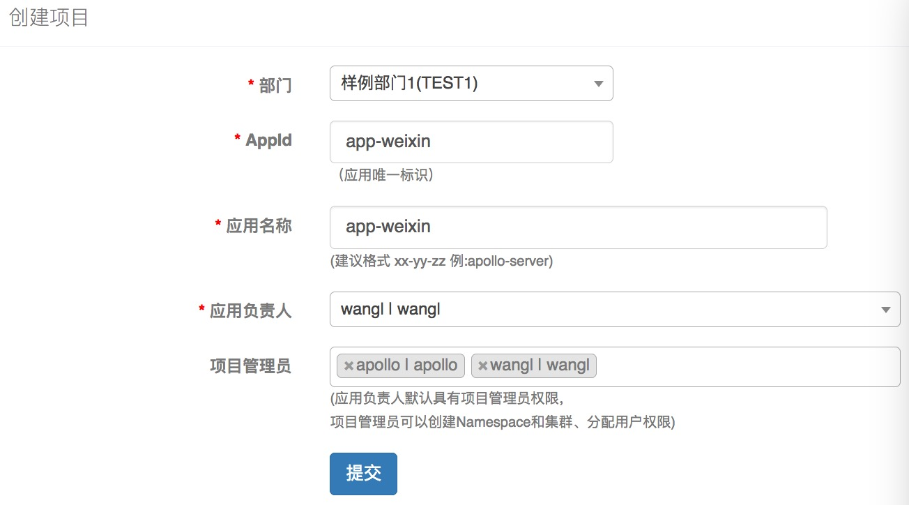
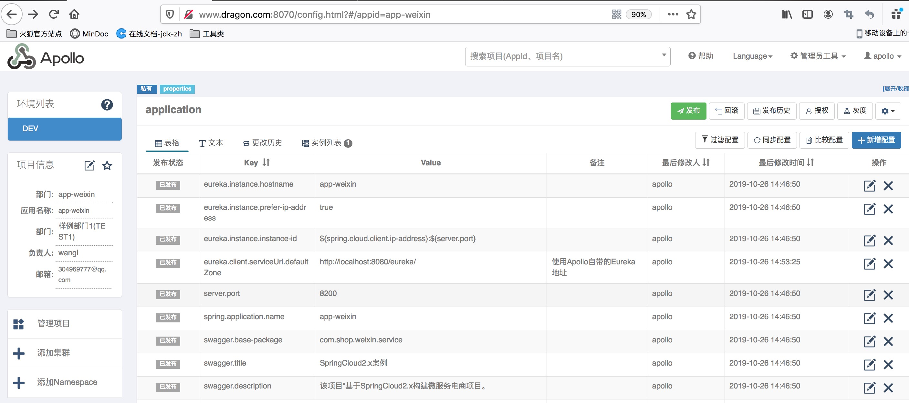
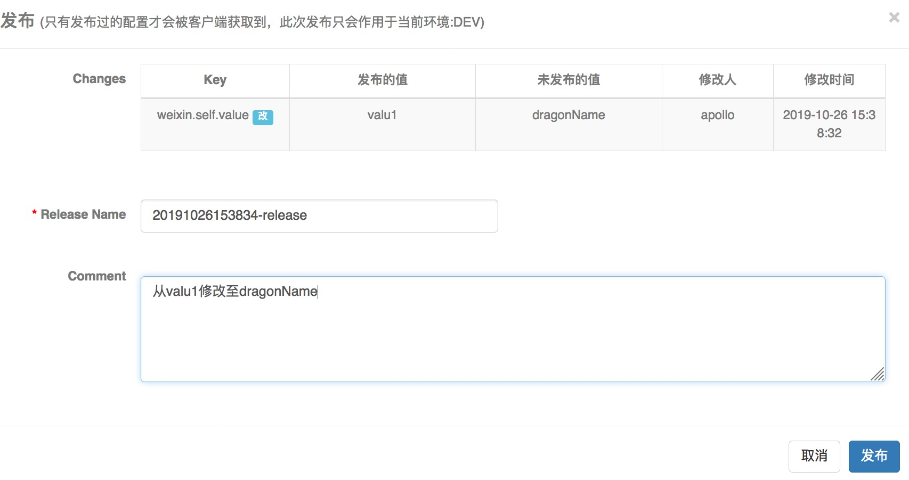

# 1、apollo集成

## 1.1、apollo的安装

首先要安装一个Apollo客户端，这里使用Apollo的Quick Start，它的地址为 [Apollo Quick Start](https://github.com/ctripcorp/apollo/wiki/Quick-Start)，下载apollo-quick-start-1.5.0.zip，然后解压该zip。在该包的`sql`文件夹里面有2个sql，这2个sql，需要在数据库里面执行。执行了sql之后，需要修改`demo.sh`，主要是修改里面的sql连接以及地址：

```shell
# apollo config db info
apollo_config_db_url=jdbc:mysql://localhost:3306/ApolloConfigDB?characterEncoding=utf8
apollo_config_db_username=root
apollo_config_db_password=root

# apollo portal db info
apollo_portal_db_url=jdbc:mysql://localhost:3306/ApolloPortalDB?characterEncoding=utf8
apollo_portal_db_username=root
apollo_portal_db_password=root

# meta server url
config_server_url=http://www.dragon.com:8080
admin_server_url=http://www.dragon.com:8090
eureka_service_url=$config_server_url/eureka/
portal_url=http://www.dragon.com:8070
```

这里是在本地部署，所以都是localhost。同事apollo集成了一个Eureka。

然后就可以运行`demo.sh`，启动会比较慢，当访问`http://www.dragon.com:8070`出现了界面，就启动成功了。

Apollo启动的时候回启动3个端口，分别是8070，8080，8090。8070是门户地址，就是配置地址，8080是在的Eureka地址，8090是AdminServer地址

## 1.2、客户端的集成

### 1.2.1、Apollo Server配置

在Apollo创建项目，这里先创建微信的项目，用于存放微信的配置



创建了项目之后，我们就在该项目里面新建配置文件。可以通过网页`https://www.toyaml.com/index.html`对`yml`和`properties`文件互换。

然后我们将`shop-service-weixin`工程的`application.yml`中的配置配置在该应用下面。为了方便，我们这里将Eureka-server的地址指向Apollo自带的Eureka：

```properties
eureka.instance.hostname = app-weixin
eureka.instance.prefer-ip-address = true
eureka.instance.instance-id = ${spring.cloud.client.ip-address}:${server.port}
eureka.client.serviceUrl.defaultZone = http://localhost:8080/eureka/
server.port = 8200
spring.application.name = app-weixin
swagger.base-package = com.shop.weixin.service
swagger.title = SpringCloud2.x案例
swagger.description = 该项目“基于SpringCloud2.x构建微服务电商项目。
swagger.version = 1.1
swagger.terms-of-service-url = www.dragon.com
swagger.contact.name = Workerryan@126.com
swagger.contact.email = xx@qq.com
```

我们来看看配置后的项目：



这里只罗列了部分配置，可以看到开发环境是DEV，应用名称是`app-weixin`。

### 1.2.2、客户端集成

要让客户端集成，需要引入jar

```xml
<dependency>
    <groupId>com.ctrip.framework.apollo</groupId>
    <artifactId>apollo-core</artifactId>
    <version>1.5.0</version>
</dependency>
<dependency>
    <groupId>com.ctrip.framework.apollo</groupId>
    <artifactId>apollo-client</artifactId>
    <version>1.5.0</version>
</dependency>
```

然后在`shop-service-weixin`工程的`application.yml`中配置上一步创建的工程的`AppId`：

```yml
app:
  id: app-weixin

apollo:
  meta: http://www.dragon.com:8080
```

`app.id`就是1.2.1创建工程的AppId，`apollo.meta`是Apollo自带的Eureka地址。

完成了上面2个步骤，我们就需要在启动类上使用`@EnableApolloConfig`开启Apollo配置。然后我们启动该项目，会有下面的日志：

```shell
2019-10-26 15:07:34.523  INFO 3823 --- [           main] c.c.f.f.i.p.DefaultServerProvider        : Environment is set to null. Because it is not available in either (1) JVM system property 'env', (2) OS env variable 'ENV' nor (3) property 'env' from the properties InputStream.
2019-10-26 15:07:34.615  INFO 3823 --- [           main] o.s.cloud.context.scope.GenericScope     : BeanFactory id=6b07974d-61f9-3980-ac14-d2cb68ce6c81
2019-10-26 15:07:34.668  INFO 3823 --- [           main] c.c.f.a.i.DefaultMetaServerProvider      : Located meta services from apollo.meta configuration: http://www.dragon.com:8080!
2019-10-26 15:07:34.668  INFO 3823 --- [           main] c.c.f.apollo.core.MetaDomainConsts       : Located meta server address http://www.dragon.com:8080 for env UNKNOWN from com.ctrip.framework.apollo.internals.DefaultMetaServerProvider
2019-10-26 15:07:39.838  INFO 3823 --- [           main] trationDelegate$BeanPostProcessorChecker : Bean 'org.springframework.cloud.autoconfigure.ConfigurationPropertiesRebinderAutoConfiguration' of type [org.springframework.cloud.autoconfigure.ConfigurationPropertiesRebinderAutoConfiguration$$EnhancerBySpringCGLIB$$c343b92f] is not eligible for getting processed by all BeanPostProcessors (for example: not eligible for auto-proxying)
2019-10-26 15:07:40.176  INFO 3823 --- [           main] o.s.b.w.embedded.tomcat.TomcatWebServer  : Tomcat initialized with port(s): 8200 (http)

...

2019-10-26 15:07:42.642  INFO 3823 --- [           main] o.s.c.n.e.s.EurekaServiceRegistry        : Registering application APP-WEIXIN with eureka with status UP
2019-10-26 15:07:42.642  INFO 3823 --- [           main] com.netflix.discovery.DiscoveryClient    : Saw local status change event StatusChangeEvent [timestamp=1572073662642, current=UP, previous=STARTING]
```

从后面的日志也可以看到，该应用注册到Eureka上去了。并且使用了上一步在Apollo里面设置的`server.port`这个端口号（因为我们在`application.yml`中并没有设置端口号）。

和Spring-Config一样，客户端从服务端拉取到配置之后，也会缓存到本地服务器上。

对于系统的一些配置，比如`server.port`，修改发布后是不会立即生效的。自定义的配置文件发布后会生效。

比如我们下面的代码：

```java
@Api(tags = "微信服务实现接口")
public interface WeiXinService {
    /**
     * 获取app应用信息
     *
     */
    @ApiOperation(value = "获取微信实体新")
    @GetMapping("/getApp")
    AppEntity getApp();
}
```

```java
@RestController
public class WeiXinServiceImpl implements WeiXinService {

    @Value("${weixin.self.value}")
    private String selfValue;

    @Override
    public AppEntity getApp() {
        return new AppEntity("dragon", selfValue);
    }
}
```

当我们配置`weixin.self.value = valu1`的时候，访问`/getApp`接口结果为：

```shell
192:~ wanglei$ curl http://www.dragon.com:8200/getApp
{"appId":"dragon","appSecret":"valu1"}
192:~ wanglei$ 
```

可以看到取到的值是`value1`，当我们修改这个配置并且发布：



点击发布后，我们会看到控制台会打印如下：

```shell
Auto update apollo changed value successfully, new value: dragonName, key: weixin.self.value, beanName: weiXinServiceImpl, field: com.shop.weixin.service.impl.WeiXinServiceImpl.selfValue
```

再来请求这个url：

```shell
192:~ wanglei$ curl http://www.dragon.com:8200/getApp
{"appId":"dragon","appSecret":"dragonName"}
192:~ wanglei$ 
```

可以看到自定义的配置发布后可以立即生效。这是因为集成了客户端之后，会有个监听器去监听。而原生的配置并没有监听，所以不会立即生效。


