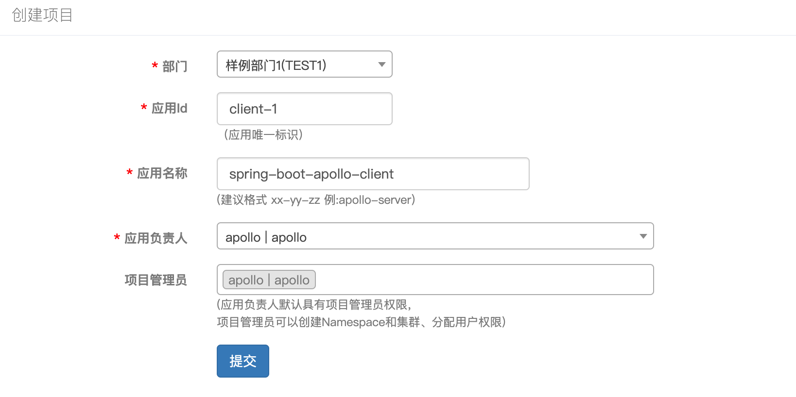
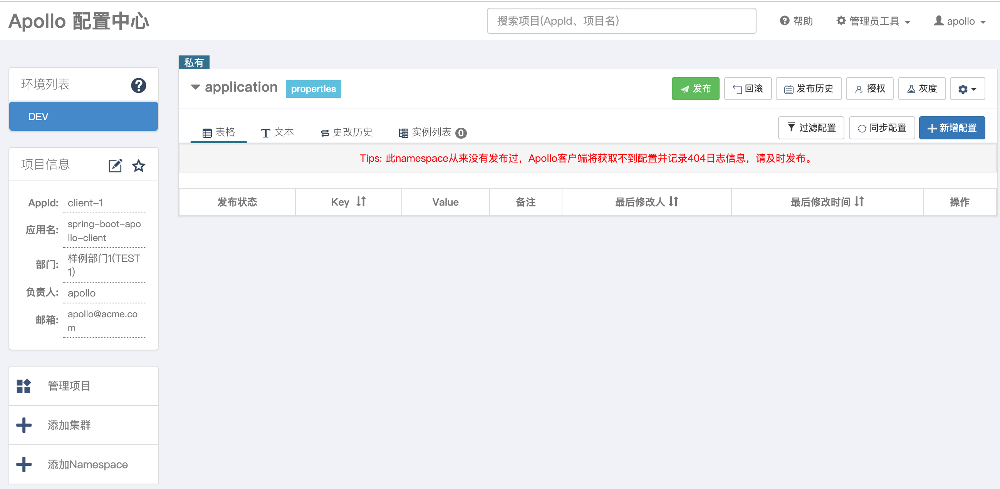
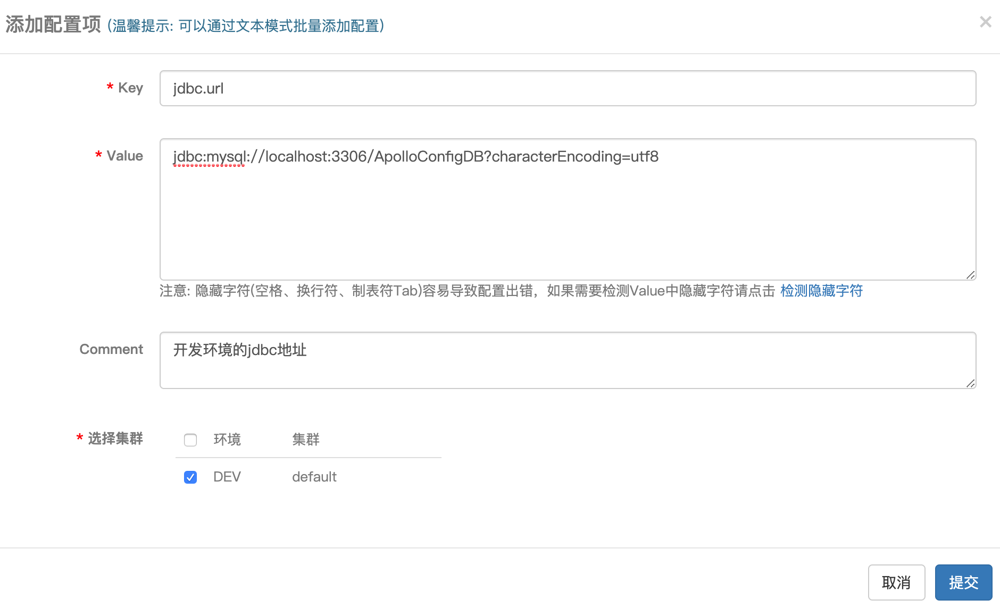
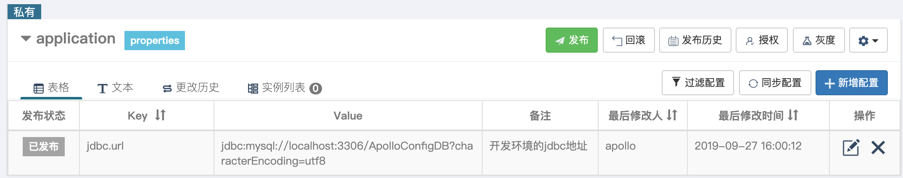
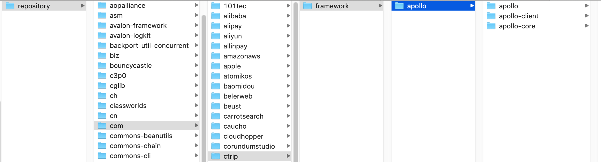

### 服务端的部署

- 去[Quick Start](https://github.com/nobodyiam/apollo-build-scripts) 下载源码 
- 执行数据库脚本apollo-quick-start/sql/apolloconfigdb.sql和apollo-quick-start/sql/apolloportaldb.sql
    - 数据库的版本要5.7以上
    -  apolloconfigdb是存储配置文件的数据库
    -  apolloportaldb是存放portal（门户网站）的数据库
- 将第一步下载的包，修改demo.sh，主要是修改其中的数据库连接：
```
# apollo config db info
apollo_config_db_url=jdbc:mysql://localhost:3306/ApolloConfigDB?characterEncoding=utf8
apollo_config_db_username=root
apollo_config_db_password=123456

# apollo portal db info
apollo_portal_db_url=jdbc:mysql://localhost:3306/ApolloPortalDB?characterEncoding=utf8
apollo_portal_db_username=root
apollo_portal_db_password=123456

# 这里需要实际情况进行ip地址和端口的修改
# config_server_url是给apollo应用端调用的，默认为8080
config_server_url=http://localhost:8080
# admin_server_url是给portal调用的，默认为8090
admin_server_url=http://localhost:8090
eureka_service_url=$config_server_url/eureka/
portal_url=http://localhost:8070
```
- 启动服务
```
wangleideMacBook-Pro:apollo-quick-start wanglei$ pwd
/Users/wanglei/Downloads/myapp/apollo/apollo-quick-start

wangleideMacBook-Pro:apollo-quick-start wanglei$ ./demo.sh start
==== starting service ====
Service logging file is ./service/apollo-service.log
Started [2509]
Waiting for config service startup.....
Config service started. You may visit http://localhost:8080 for service status now!
Waiting for admin service startup...
Admin service started
==== starting portal ====
Portal logging file is ./portal/apollo-portal.log
Started [2569]
Waiting for portal startup....
Portal started. You can visit http://localhost:8070 now!
wangleideMacBook-Pro:apollo-quick-start wanglei$ 
```
这里启动了几个：
- 注册中心，实际是启动了一个eureka，地址为http://localhost:8080
- 启动portal，地址为http://localhost:8070

进入http://localhost:8070，输入用户名apollo，密码admin后登录

### 2、服务端的使用

要使用注册中心，实现要创建一个项目


在上面的项目中，我们创建了一个应用，里面有2个很重要的概念：

- 应用id，这个是客户端的应用id
- 应用名称，客户端的应用名称

创造应用后，就可以在控制面板看到该应用：



现在这个应用还没有任何的配置文件，默认的环境是DEV，左侧的项目信息，就是我们刚刚填写的信息。 点击右侧的新增配置：



在这里，添加了一个jdbc.url的属性，点击提交



点击提交后，状态属于未发布状态，点击上面的发布，就变成了发布状态。


### 3、客户端的部署

#### 3.1、准备工作

要使用客户端链接服务端，先去[GitHub地址](<https://github.com/ctripcorp/apollo>)下载源码，源码下载完成之后，进入到scripts文件夹，里面会有个`build.sh`文件:

```shell
wangleideMacBook-Pro:apollo wanglei$ ls
CODE_OF_CONDUCT.md   apollo-adminservice  apollo-client        apollo-demo          apollo.iml
CONTRIBUTING.md      apollo-assembly      apollo-common        apollo-mockserver    doc
LICENSE              apollo-biz           apollo-configservice apollo-openapi       pom.xml
README.md            apollo-buildtools    apollo-core          apollo-portal        scripts
wangleideMacBook-Pro:apollo wanglei$ cd scripts/
wangleideMacBook-Pro:scripts wanglei$ ls
apollo-on-kubernetes build.sh             docker-quick-start
build.bat            db                   sql
wangleideMacBook-Pro:scripts wanglei$ 
```

执行该文件

```
wangleideMacBook-Pro:scripts wanglei$ ./build.sh 
==== starting to build config-service and admin-service ====
[INFO] Scanning for projects...
...
==== building portal finished ====
wangleideMacBook-Pro:scripts wanglei$ 
```

该文件执行完毕之后，就会把核心的依赖打入到本地maven仓库中：



然后将该源码打包（`mvn package`)，打包之后，将apollo-client和apollo-core安装到本地maven仓库里面。

#### 3.2、client端

##### 1、新建工程

本地jar准备好之后，新建spring-boot工程，其`pom.xml`文件内容如下：

```xml
<?xml version="1.0" encoding="UTF-8"?>
<project xmlns="http://maven.apache.org/POM/4.0.0"
         xmlns:xsi="http://www.w3.org/2001/XMLSchema-instance"
         xsi:schemaLocation="http://maven.apache.org/POM/4.0.0 http://maven.apache.org/xsd/maven-4.0.0.xsd">
    <parent>
        <artifactId>spring-boot</artifactId>
        <groupId>com.dragon</groupId>
        <version>1.0-SNAPSHOT</version>
    </parent>
    <modelVersion>4.0.0</modelVersion>

    <artifactId>spring-boot-apollo-client</artifactId>

    <description>apollo分布式配置中心的客户端</description>

    <properties>
        <java.version>1.8</java.version>
        <spring-cloud.version>Greenwich.SR1</spring-cloud.version>
        <alibaba.druid>1.1.10</alibaba.druid>
        <mybatis-plus.version>3.1.1</mybatis-plus.version>
        <elasticsearch.version>7.1.1</elasticsearch.version>
    </properties>

    <dependencies>
        <dependency>
            <groupId>org.springframework.boot</groupId>
            <artifactId>spring-boot-starter-web</artifactId>
        </dependency>

        <dependency>
            <groupId>org.springframework.cloud</groupId>
            <artifactId>spring-cloud-starter-netflix-eureka-client</artifactId>
            <version>2.0.1.RELEASE</version>
        </dependency>

        <!-- apollo 携程apollo配置中心框架 -->
        <dependency>
            <groupId>com.ctrip.framework.apollo</groupId>
            <artifactId>apollo-client</artifactId>
            <version>1.0.0</version>
        </dependency>
        <dependency>
            <groupId>com.ctrip.framework.apollo</groupId>
            <artifactId>apollo-core</artifactId>
            <version>1.0.0</version>
        </dependency>
    </dependencies>


    <dependencyManagement>
        <dependencies>
            <dependency>
                <groupId>org.springframework.cloud</groupId>
                <artifactId>spring-cloud-dependencies</artifactId>
                <version>${spring-cloud.version}</version>
                <type>pom</type>
                <scope>import</scope>
            </dependency>
        </dependencies>
    </dependencyManagement>

    <build>
        <plugins>
            <plugin>
                <groupId>org.springframework.boot</groupId>
                <artifactId>spring-boot-maven-plugin</artifactId>
            </plugin>
        </plugins>
    </build>

</project>
```

##### 2、application配置文件

`pom.xml`准备好之后，就在`src/main/resources`里面新建一个`application.yml`文件：

```properties
server:
  port: 8001
spring:
  application:
    name: spring-boot-apollo-client

eureka:
  client:
    service-url:
      ## 这里的eureka地址就是在启动apollo的时候，apollo创建的eureka地址
      defaultZone: http://localhost:8080//eureka

  instance:
    hostname: order
    prefer-ip-address: true
    instance-id:  ${spring.cloud.client.ip-address}:${server.port}
```

因为8080已经被占用了，所以这里`server.port`指定为8001。

##### 3、指定appId

然后我们需要在`src/main/resources`下面新建一个名称为`META-INF`的文件夹，该文件夹里面新建一个名称为`app.properties`的配置文件：

```properties
app.id=client-1
```

该配置文件要和第2步的新建项目的AppId一致：


要和这里的一致。

##### 4、指定环境

我们在服务端的时候，创建的项目是属于DEV环境，所以我们需要在项目启动的时候指定环境，指定环境有2中方式：

4.1、启动脚本中指定

在启动脚本中，可以添加`-Denv=DEV`来指定我们的环境是DEV环境

4.2、系统文件设定

可以在系统里面设定一个文件，这个文件是：

```
对于Mac/Linux，文件位置为/opt/settings/server.properties
对于Windows，文件位置为C:\opt\settings\server.properties
```

该文件默认是没有的，需要新建，文件里面的内容只有一行：

```
env=DEV
```

经过了上面的设定，我们就指定了环境

#####  5、指定apollo配置中心服务端地址

接下来是最重要的一步，需要让客户端知道apollo配置中心的地址，这时候需要在`src/main/resources`里面新建一个名称为`apollo-env.properties`的文件，该文件中就指定了配置中心的地址:

```properties
local.meta=http://192.168.212.162:8080
dev.meta=http://192.168.212.162:8080
fat.meta=${fat_meta}
uat.meta=${uat_meta}
lpt.meta=${lpt_meta}
pro.meta=${pro_meta}
```

经过了上面的5个步骤，我们就在客户处集成了apollo客户端，来看看：

```shell
wangleideMacBook-Pro:~ wanglei$ curl http://localhost:8001//jdbcUrl
jdbc:mysql://192.168.0.10:3306/ApolloConfigDB?characterEncoding=utf8
wangleideMacBook-Pro:~ wanglei$ 
```

可以看到，我们已经获取到了地址


