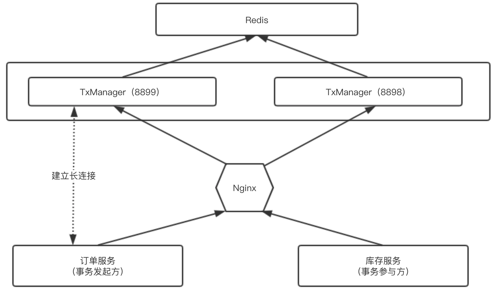
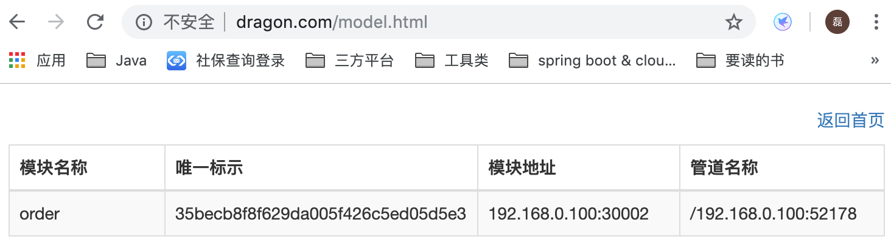

### 1、LCN实现分布式事务的原理：
- 1、LCN客户端（发起方和参与方）必须要注册到事务协调者中，建立一个长连接。
- 2、订单服务（发起方）在调用库存服务（参与方）之前会向事务协调者（TxManager）申请创建一个事务的分组id
- 3、订单服务调用库存服务的时候，会在请求头中携带该事务的分组id，一起发送给库存服务
- 4、库存服务从请求头中获取到事务分组id，在业务逻辑代码执行完毕之后会采用假关闭，不会提交该事务，也不会关闭JDBC连接
- 5、订单服务执行完毕之后，如果没有任何异常，订单服务使用对应的事务分组id，通知给TxManager事务协调者。
           然后TxManager事务协调者根据该事务分组id，通知给所有的参与方提交事务。
           如果订单服务最后执行出现异常了，订单服务是走本地事务进行回滚的，所以只需要关心参与方的事务回滚。
           这时候发起方也会携带第1步申请的事务id，通知TxManager，TxManager就会回滚所有和该事务分组id相关的参与方

### 2、事务协调者启动流程：
- 1、修改tx-manager的eureka注册地址
- 2、修改redis地址、端口和密码，redis里面存储的是事务分组id
> 需要注意的是：<br>
> 1、TxManager默认注册到Eureka上的HTTP端口为8899，可以进行修改，是通过配置文件中的`server.port`属性指定的。<br>
> 2、TxManager默认的Netty端口为9999，是通过配置文件中的`tm.socket.port`属性指定的。


### 3、客服端的整合：
- 1、LCN默认不支持SpringCloud2.0，需要使用别人修改过后的版本，并将jar安装到本地maven仓库
- 2、在application.yml中添加tm.manager.url = http://127.0.0.1:8899/tx/manager/ 用于配置TxManager的地址
- 3、在src/main/java中，添加TxManagerHttpRequestServiceImpl和TxManagerTxUrlServiceImpl
- 4、在需要分布式事务的方法上增加@TxTransaction注解，比如spring-cloud-order/src/main/java/com.dragon.order.service.OrderService#insert(）
           如果是发起方，那么需要指定isStart参数为true，如：@TxTransaction(isStart = true)

> 需要注意的是：<br>
> 1、如果参与者在默认时间内没有收到事务协调者的通知，那么会回滚事务（默认是5秒），这个默认时间是在tx-manager的属性文件tm.compensate.maxWaitTime里面配置的

### 4、更加详细的原理
#### 4.1、LCN获取tm事务协调者测试地址的原理

在第3步客户端整合里面，第2点我们知道要在`application.yml`中配置`tm.manager.url`，这个url其实是事务协调者(TxManager)的http地址（也就是server.port指定的地址）
但是，我们在第1步里面指定LCN客户端和TxManager之间要维护一个长连接，而且第2步也知道这个长连接的端口是TxManager中的`tm.socket.port`来指定的，底层是走的Netty，
那么客户端是如何知道TxManager的长连接地址的？其实是这样的：
1、LCN客户端项目启动的时候，会读取配置文件`tm.manager.url`指定的tm事务协调者的注册地址<br>
2、然后会向该事务协调者注册地址发送一个请求，获取对应的LCN底层协议ip和端口号，这个端口号就是第2步里面事务协调者`tm.socket.port`指定的号码，然后通过Netty进行长连接，在客户端启动的时候会有如下的日志：<br>
```
2019-10-05 19:58:23.202  INFO 817 --- [           main] o.s.b.w.e.u.UndertowServletWebServer     : Undertow started on port(s) 30002 (http) with context path ''
2019-10-05 19:58:23.203  INFO 817 --- [           main] .s.c.n.e.s.EurekaAutoServiceRegistration : Updating port to 30002
2019-10-05 19:58:23.204  INFO 817 --- [           main] c.c.t.s.listener.ServerListener          : onApplicationEvent -> onApplicationEvent. org.springframework.boot.web.embedded.undertow.UndertowServletWebServer@523abba9
load tm.manager.url 
2019-10-05 19:58:23.211  INFO 817 --- [           main] c.c.t.n.s.TxManagerHttpRequestHelper     : load HttpRequestService .
httpGet-start
httpGet-end
2019-10-05 19:58:23.773  INFO 817 --- [           main] c.c.t.n.s.i.NettyDistributeServiceImpl   : get txManager ->{"ip":"192.168.1.8","port":9999,"heart":15,"delay":5,"compensateMaxWaitTime":5000}

2019-10-05 19:58:23.787  INFO 817 --- [           main] c.c.t.n.s.i.NettyDistributeServiceImpl   : host:192.168.1.8,port:9999,heart:15,delay:5,compensateMaxWaitTime:5000
2019-10-05 19:58:23.787  INFO 817 --- [           main] c.c.t.n.s.i.NettyDistributeServiceImpl   : host:192.168.1.8,port:9999,heart:15,delay:5,compensateMaxWaitTime:5000
2019-10-05 19:58:23.934  INFO 817 --- [           main] c.c.t.n.service.impl.NettyServiceImpl    : connection txManager-socket-> host:192.168.1.8,port:9999
2019-10-05 19:58:24.162  INFO 817 --- [           main] c.c.t.l.service.impl.InitServiceImpl     : socket-start..
2019-10-05 19:58:24.166  INFO 817 --- [           main] com.dragon.order.OrderApplication        : Started OrderApplication in 13.404 seconds (JVM running for 14.111)
```


### 5、TxManager的高可用
 从上面可以看到TxManager是一个核心的组件，在分布式环境下，是需要做集群的。要对TxManager做集群有2种方式：

#### 5.1、通过Nignx负载进行集群
首先启动多个TxManager（这些TxManager都链接是同一个Redis），然后通过Nginx负载功能，对外提供访问，比如下面的配置：
```shell
upstream  backServer{
	    server 192.168.0.100:8899;
	    server 192.168.0.100:8898;
}
server {
    listen       80;
    server_name  www.dragon.com;
    location / {
        ### 指定上游服务器负载均衡服务器
        proxy_pass http://backServer/;
        ###nginx与上游服务器(真实访问的服务器)超时时间 后端服务器连接的超时时间_发起握手等候响应超时时间
        proxy_connect_timeout 5s;
        ###nginx发送给上游服务器(真实访问的服务器)超时时间
        proxy_send_timeout 5s;
        ### nginx接受上游服务器(真实访问的服务器)超时时间
        proxy_read_timeout 5s;
        index  index.html index.htm;
    }
}
```
在上面的配置中，我们的Tm协调器的地址在192.168.0.100。然后我们启动该Nginx。

启动Nginx之后，LCN客户端链接的就是Nginx配置的这个负载均衡地址：

```yml
tm: 
  manager: 
#     url: http://127.0.0.1:8899/tx/manager/
      url: http://www.dragon.com/tx/manager/
```
也就是说，事务协调者集群的原理就是：
1、首先通过Nginx配置多个tm协调者负载均衡配置，然后LCN客户端启动项目的时候访问Nginx负载均衡地址获取LCN协议通过IP地址和端口号，并且对该端口保持长连接<br>
2、因为LCN客户端与TM协调者保持的是长连接，所以当其中一个tm协调者宕机之后，LCN客户端会立即重新到获取负载均衡的地址（通过Nginx的故障转移轮询到未宕机的集群，从而获取到另一台机器的Netty的地址和ip，建立新的长连接）。



Nginx配置好了负载均衡之后，LCN客户端会从Nginx指定的上游服务器获得Netty的端口和ip地址，然后通过这个Netty端口进行长连接，加入上面的8899服务器宕机之后，那么Nginx会路由到8898服务器，然后订单服务就会链接到8898上，然后保持一个长连接。

然后起码启动库存服务（事务参与方），库存服务的`application.yml`里面的配置是一样的。

其实在上面的集群方案中是有问题的，问题就出在Nginx的负载均衡上面，因为第一个服务连接的时候，Nginx会负载到8899上面，所以订单服务是和8899建立的长连接，但是第二个服务连接的时候，Nginx会负载到8898上， 所以库存服务是和8898建立长连接，这就导致了事务协调者的不一致。导致的原因就是Nginx的赋值均衡，导致事务协调者不同步，但是底层的数据是共享的（数据都是保存在Redis中的）。通过LCN管控台的在线模块也可以看到：




可以看到同一个地址，却出现了不同的结果，而且一次只有一条数据，这就是Nginx负载导致的数据不同步。因为在线模块的原理就是长连接。如果2个服务连接的不是同一个TxManager，那么最终


#### 4.2、修改源码


